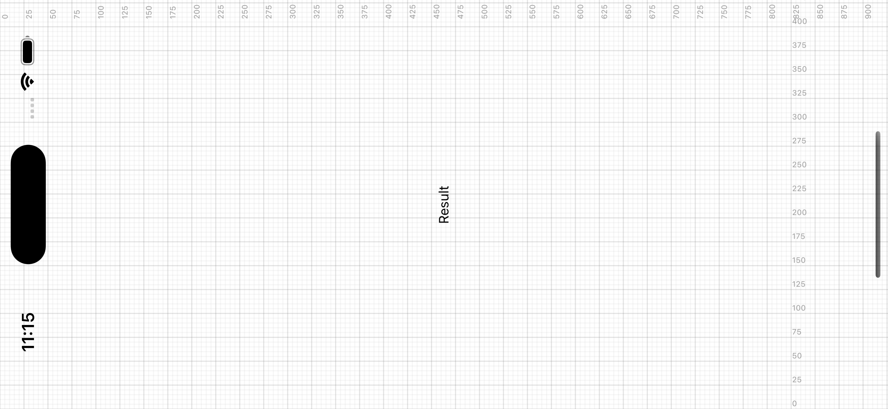

# react-native-grid-overlay

A quick tool to draw a grid overlay to help with pixel perfect layouts



## Example

Try the example using `yarn example ios`

## Installation

```sh
npm install react-native-grid-overlay
```

## Usage

```js
import { GridOverlay } from 'react-native-grid-overlay';

export default function App() {
  return (
    <>
      <GridOverlay
        color={'black'}
        opacity={0.5}
        stepSize={5}
        height={height}
        width={width}
      />
    </>
  );
}
```

## Contributing

See the [contributing guide](CONTRIBUTING.md) to learn how to contribute to the repository and the development workflow.

## License

MIT

---

Made with [create-react-native-library](https://github.com/callstack/react-native-builder-bob)
